## 简介

Visual Studio Code （简称 VSCode 或 VSC）是由微软开发的开源、免费、轻量且拥有跨平台支持的代码编辑器，这意味着无论是 Windows, MacOS 还是 Linux 平台上你都可以运行 VScode。

除此之外，VSCode 还拥有强大的代码自动补全，丰富的插件扩展和多语言支持，可自定义程度也相对较高，因此深受广大开发者喜爱。

这篇文档将带大家熟悉 VSCode 的安装和配置（以 Windows 11 家庭中文版系统为例），并在 VSCode 里编译运行自己的第一个程序。

## 下载

<Tabs items={['官网下载', '本站仓库下载']} defaultIndex={0}>
  <Tab value="官网下载">
    进入 [Visual Studio Code 下载官网](https://code.visualstudio.com/Download)，按下图的指示点击按钮下载
    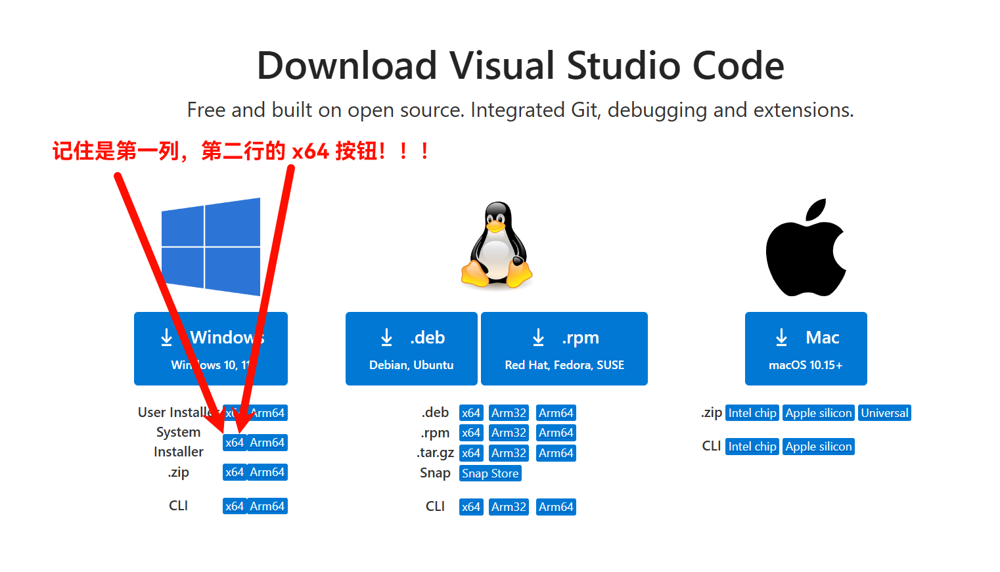
  </Tab>
  <Tab value="本站仓库下载">[点击此处进入仓库](/mirror)</Tab>
</Tabs>

## 安装

### 安装 VSCode

安装程序下载完成后，双击打开，之后按照安装程序的指引完成安装。在这里首先勾选 **_“我同意此协议”_**

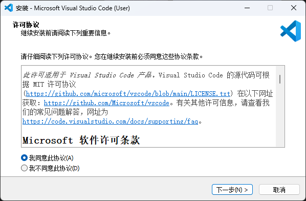

建议将VSCode安装至空间充足的磁盘上，在这里不建议直接安装至C盘。 ~~除非你的电脑只有C盘~~

推荐的安装姿势是在你空间充足的磁盘（如D盘）内新建一个文件夹，为它起一个名字（例如：vscode），然后将VSCode安装在你新建的文件夹内，这样一来，你的VSCode安装路径应当看起来是这样的：

> `D:/vscode/` 或者 `D:/Software/vscode/`

前者或后者并没有什么区别，只取决于你个人的喜好。

<Callout type="info" title="Tips">
Q: “...等一下，我的D盘里没有 `Software` 这个文件夹！？”  
A: 没有关系，新建一个就好，这并不是什么问题。
</Callout>

另外需要特别注意的是，安装路径中 **最 好 不 要 出 现 中 文**，例如 `D:/VS扣得` 就是一个非常差劲的安装路径名称，使用这样的安装路径可能会导致一些意料之外的错误。

> 顺带一提，我个人也不太喜欢安装路径中出现空格，所以我会把默认的安装文件夹名 “Microsoft VS Code” 换成 “vscode”，实际的安装中，你可以按照自己的喜好来自由命名 VSCode 所安装在的文件夹。

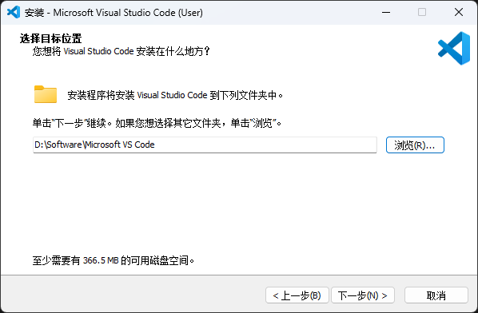

这一步会在你的开始菜单创建一个快捷方式，如果你不想要在开始菜单创建快捷方式，勾选下方的 **_“不创建开始菜单文件夹”_** 即可。

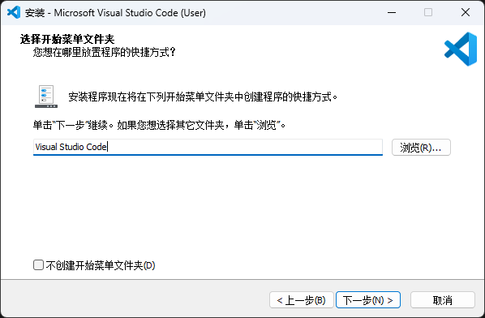

接下来勾选下图中的必要选项，同样地，如果你不想在桌面上创建快捷方式，取消勾选 **_“创建桌面快捷方式”_** 即可。

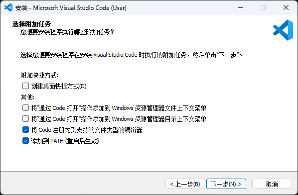

最后在开始正式安装前，目测检查一下安装信息是否有误

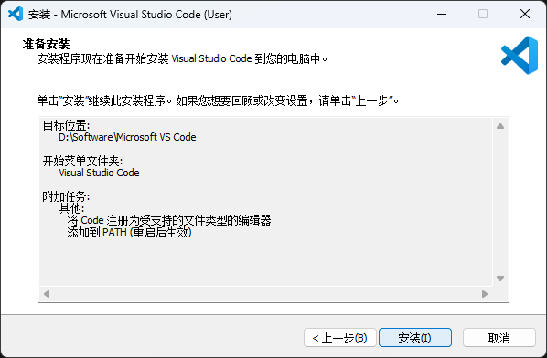

如果没有什么其他问题，点击安装并耐心等待几分钟，VSCode 本体就在你的电脑上安装好了。

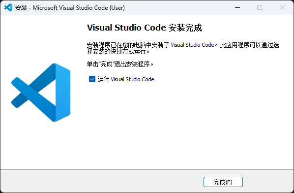

安装完成之后勾选 **_“运行 Visual Studio Code”_** 并点击完成，不出意外的话，你就可以看到 VSCode 的欢迎界面了，VSCode 本体的安装也就此完成。

### 下载并安装 MinGW-W64

还记得我们在开头说过什么吗？VSCode 只是一个**代码编辑器**而已，并不是一个完整的 **IDE（集成开发环境）**，换句话说，你刚刚安装好的 VSCode 其实只是一个高级一点的记事本，并不具备编译和调试程序的能力等等。要想在VSCode里进行C++程序的编写，你还需要安装一些编译工具。

在 Windows 平台上，我们一般使用 **_MinGW-W64_** 作为我们的编译工具集。

> ...你说得对，但是怎么安装呢？

首先下载MSYS2的安装程序：[点击此处进入仓库下载](/mirror)

> ...MSYS2？那又是什么？

<Callout type="info" title="Tips">
  **MSYS2** 是一个独立于操作系统的轻量级开发环境，主要用于在 Windows 上提供类似 Unix 的体验。它是 "**M**inimal **SYS**tem **2**" 的缩写，继承自 **MinGW** 和 **MSYS** 项目。
</Callout>

上面是对 MSYS2 的一段简单描述，不过我们并不需要知道那么多，只需要知道它可以帮我们安装好我们需要的 **MinGW-W64工具集**，这就够了。

下载完成后，双击打开安装程序，按照指引完成MSYS2的安装

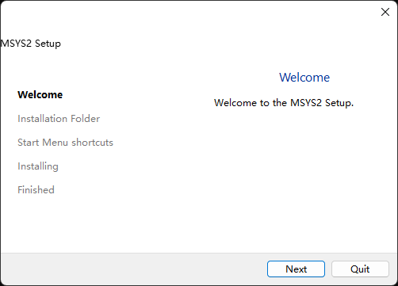

同样地，推荐安装在空间充足的磁盘（如D盘），安装路径中最好不要出现中文名称。

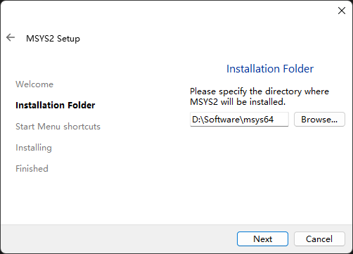

在开始菜单中创建一个快捷方式，并且你不能取消这一步。 ~~是的，你没得选~~

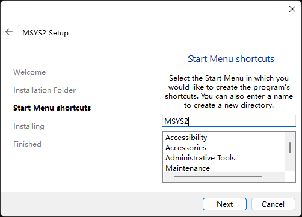

耐心等待，放轻松，由于大陆的特色网络环境，出现卡50%的情况是正常的，一般只需多等几分钟即可。

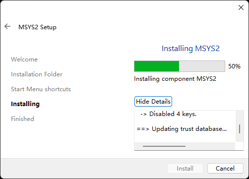

安装结束后，**勾选 `Run MSYS2 now` 这个选项**，然后再点击 Finish 按钮，这样在关闭安装程序后会自动弹出一个 MSYS2 的终端窗口。

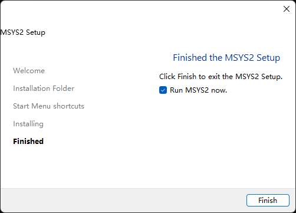

> 完蛋了！我好像忘记勾那个框框了！
> —— 不用太慌张，如果忘记勾选的话，直接在 Windows 的搜索栏里搜索 **“MSYS2 UCRT64”** 并运行即可，这同样会呼出 MSYS2 的终端窗口

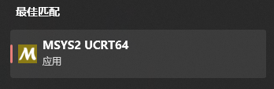

在弹出的窗口中，输入下面的指令来安装 MinGW-W64 工具集：

```bash
pacman -S --needed base-devel mingw-w64-ucrt-x86_64-toolchain
```

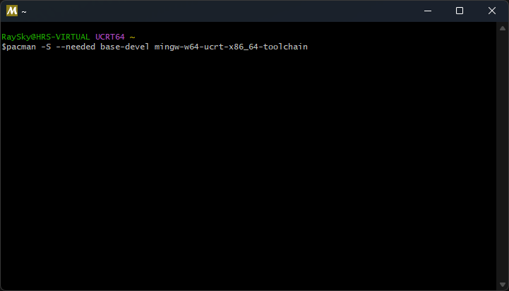

然后在终端中按回车键接受默认选项

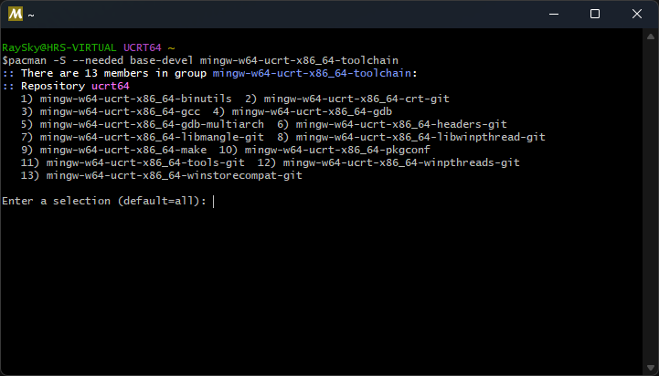

最后在终端中输入 Y 并按回车键（或者直接按回车键）来确认安装

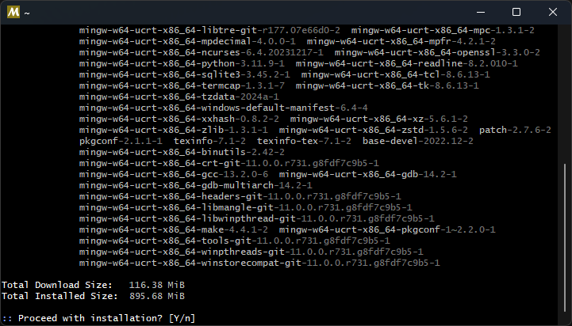

依旧耐心等待即可。

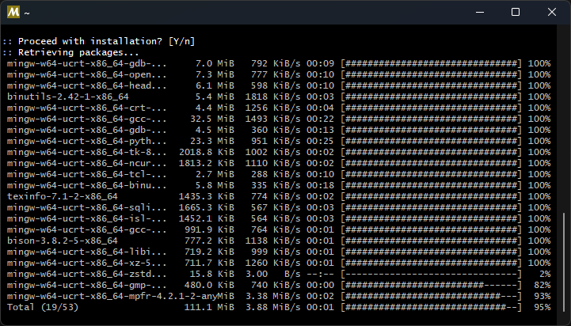

这是安装完成之后的样子，确认所有组件都已经安装完毕后，你就可以安全关闭终端窗口了，MINGW-W64 至此也就安装完毕。

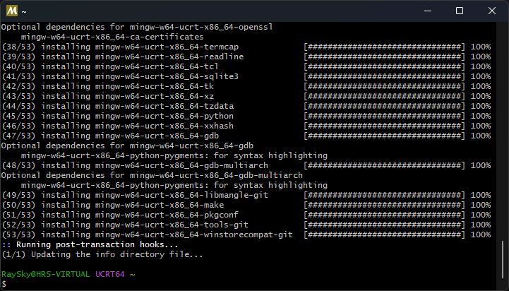

## 配置

### 必要的准备——配置环境变量

首先让我们打开 Windows 设置，找到 **_系统->系统信息->高级系统设置_** 并点击

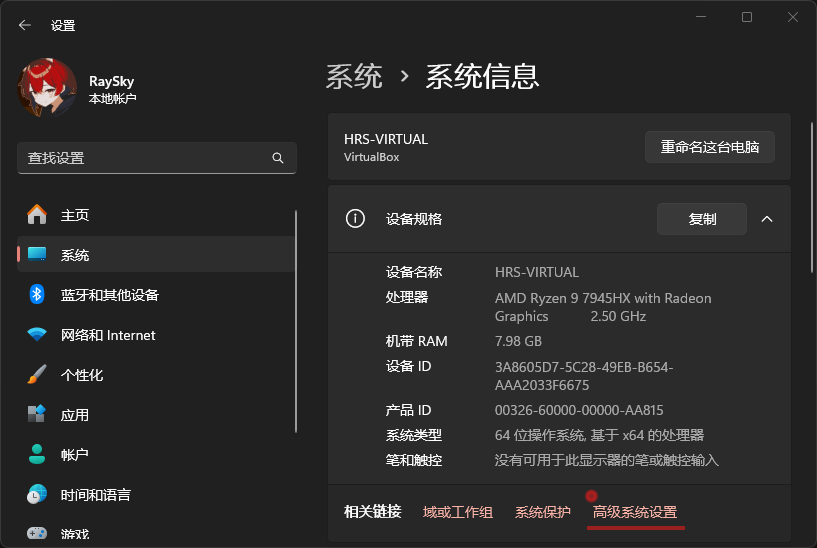

然后点击进入 **_高级->环境变量_**

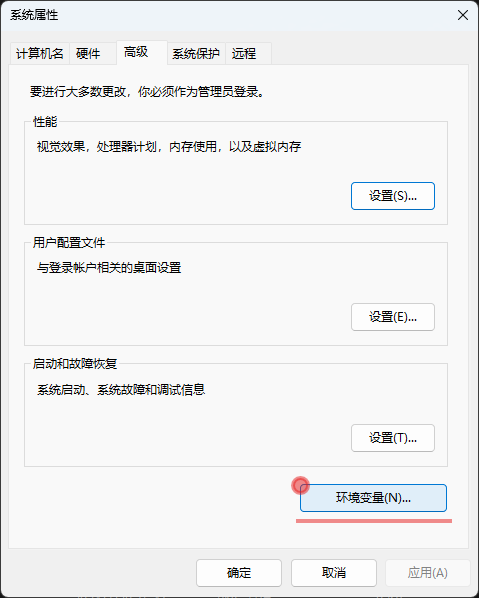

<Callout type="info" title="Tips">
  或者更简单一些 你也可以直接在 Windows 的搜索栏中搜索 ***“编辑系统环境变量”*** 并打开，同样可以打开上图所示的窗口。
  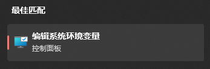
</Callout>

在下方的 **_“系统变量”_** 中找到 **_“Path”_**，直接双击进入编辑，或者单击之后再点击下方的 **_“编辑”_**

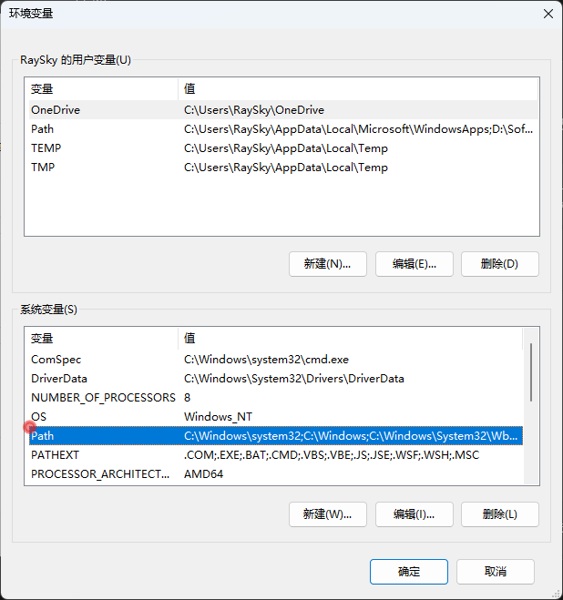

然后点击 **_“新建”_**，并输入你的工具集所在目录的路径

例如，如果你将 MSYS2 默认安装在了 C 盘，默认的路径应该为 `C:\msys64\ucrt64\bin\`

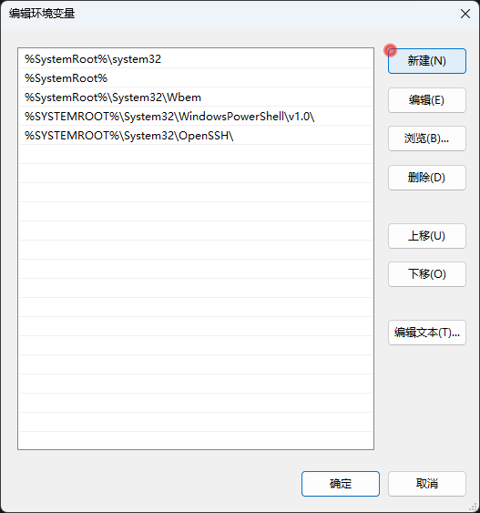

本教程示例中的目录是 `D:\Software\msys64\ucrt64\bin\` 如果你在安装时选择了其他的安装目录，你就需要填写你当时安装 mingw64 的目录。总之，你需要输入的东西看起来应该是像 `X:\xxx\...\ucrt64\bin\` 的样子

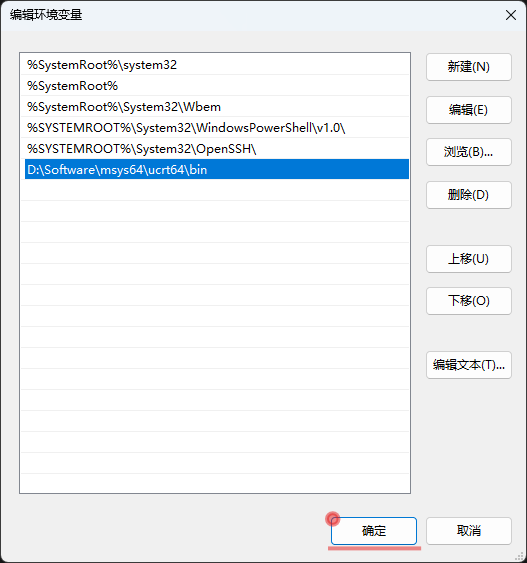

最后，点击 **_“确定”_** 来保存环境变量配置。然后打开 cmd 或 powershell，依次输入 `gcc --version` ，`g++ --version`，`gdb --version` 来测试环境变量是否配置正常

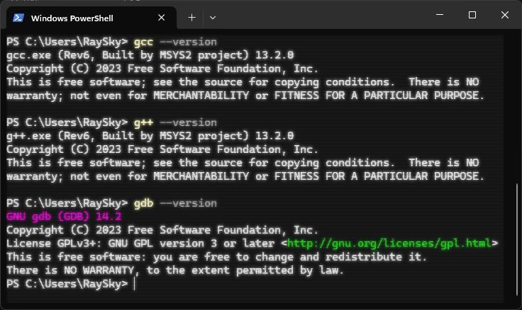

如果你的终端里像上图所示显示了 gcc，g++，gdb 的版本信息，那么很好，你已经成功地把我们所需的环境变量配置完毕了。

### 同样不可或缺——配置 VSCode

接下来，让我们打开先前安装好的 VSCode，VSCode 会自动打开一个引导教学界面，这篇文档中我们只会在这个界面中进行一些必要的设置

<Callout type="info" title="Tips">
  在跟随本文档配置完成后，如果还想要更进一步查看欢迎页面的其他选项，可以使用快捷键 **_“Ctrl+Shift+P”_** 打开命令面板，输入 **_“Welcome: Walkthrough”_** 来重新选择并打开 VSCode 的引导教学界面
</Callout>

首先可以选择一个你喜欢的主题，VSCode 目前有四种预设好的官方主题可供选择

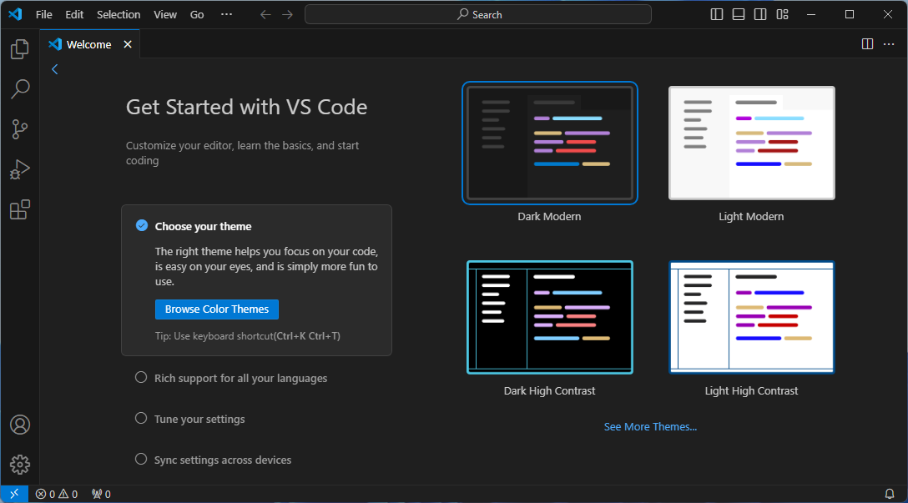

进入下一步并点击 **_“Browse Language Extensions”_**

然后在左侧弹出的市场中安装 **_“C/C++ Extension Pack”_** 这个扩展

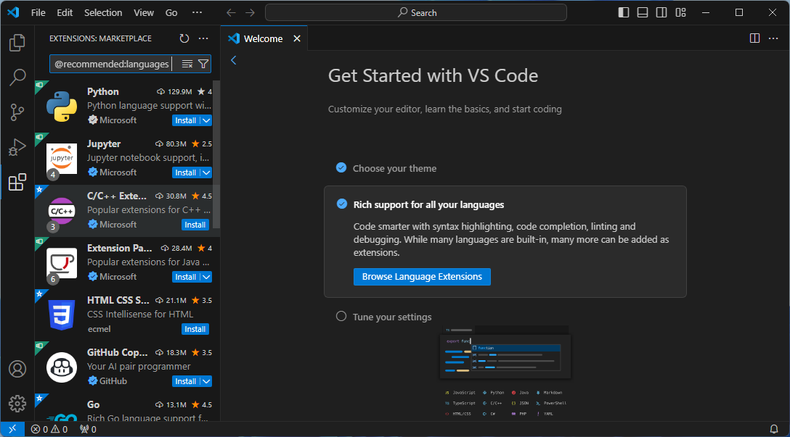

VSCode 默认为英文界面，如果需要中文界面，同样可以在扩展市场中安装：在扩展市场中搜索 **_“Chinese (Simplified)”_** 来找到并安装简体中文语言包，重启 VSCode 后就可以将 VSCode 切换到中文界面

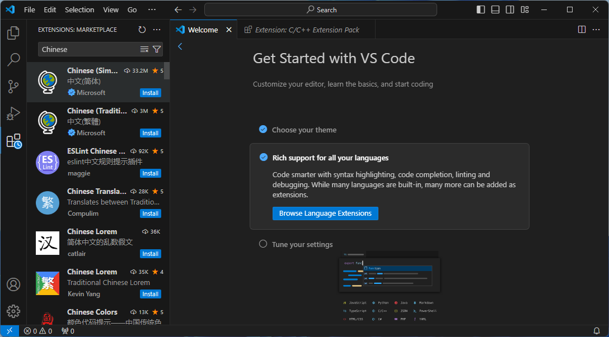

接下来让我们回到扩展界面，删除搜索框中的搜索内容，此时扩展商店中会列出我们已经安装好的扩展

然后找到 **_“C/C++”_** 这个扩展，点击右边的齿轮图标进入扩展设置

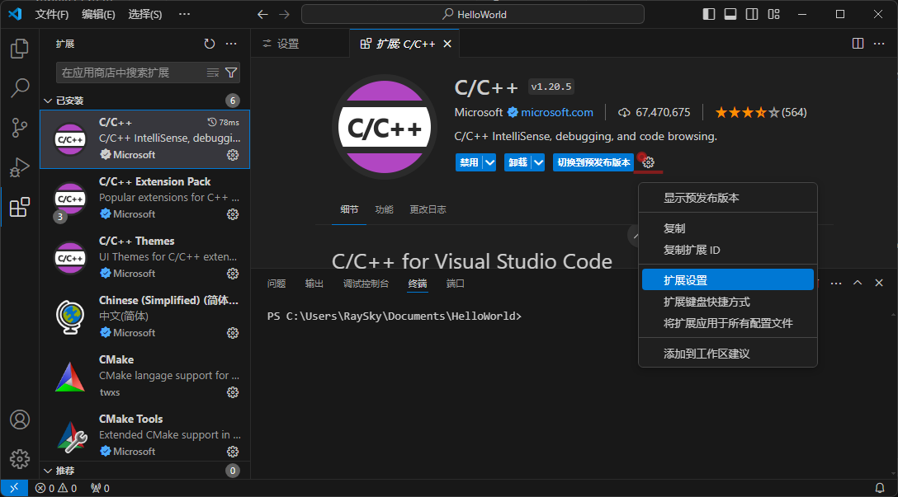

找到 **_“用户”_** 设置中的 **_“C_Cpp > Default: Compiler Path”_**，点击 **_“在 settings.json 中编辑”_**

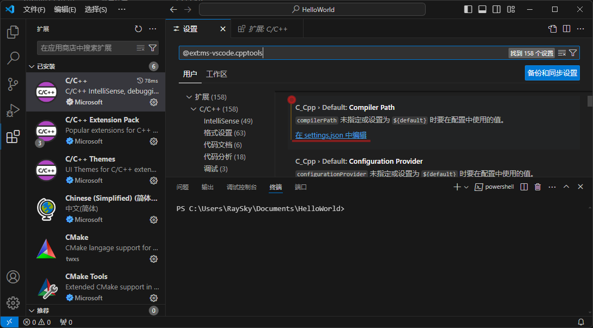

如图所示，输入你的工具集所在目录的路径

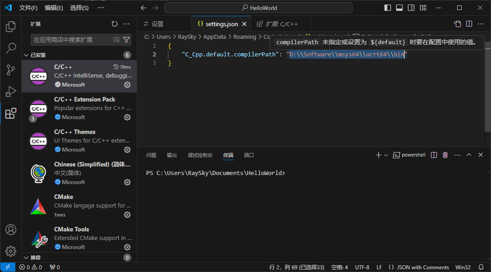

<Callout type="info" title="Tips">
  这一步所填写的路径与先前我们配置环境变量时所填写的的路径相同，只不过需要注意的是，在 VSCode 的配置文件中，分隔目录层级的符号为两个反斜杠 `\\` 或者一个正斜杠 `/` ，而不是一个反斜杠 `\`

  也就是说，你需要填写的路径应该长这样：`D:\\Software\\msys64\\ucrt64\\bin`  
  或者这样：`D:/Software/msys64/ucrt64/bin`

  二者都是可以的，你可以根据个人喜好选择一种方法填写。
</Callout>

是时候喝口水，伸个懒腰，然后休息一下了。至此配置部分已经全部结束，接下来我们终于可以愉快地使用 VSCode 来编写我们的第一个 C++ 程序了。

## 使用

### 记得从文件夹里开！——在 VSCode 里编写你的第一个 C++ 程序

在 VSCode 中编写代码时，我们需要创建一个 **_文件夹_** 来存放我们的 **_源代码_** 和 **_项目配置文件_**

让我们提前创建好一个文件夹，命名为 “HelloWorld”

<Callout type="warning" title="注意">
  在 VSCode 中，你的项目文件夹所在路径中 **一 定 不 能 有 中 文 存 在**，类似 `C:/Users/Documents/Code/你好世界` 或者是 `C:/Users/Documents/代码/HelloWorld` 的项目路径都会导致你的程序在 VSCode 中无法编译运行，在使用 VSCode 时请务必牢记这点
</Callout>

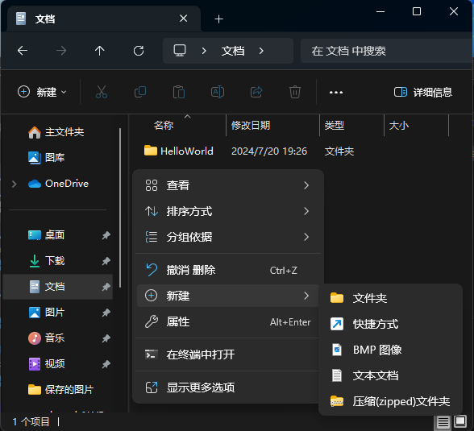

然后在 VSCode 中选择 **_打开文件夹_**，找到我们新创建的项目文件夹并打开它

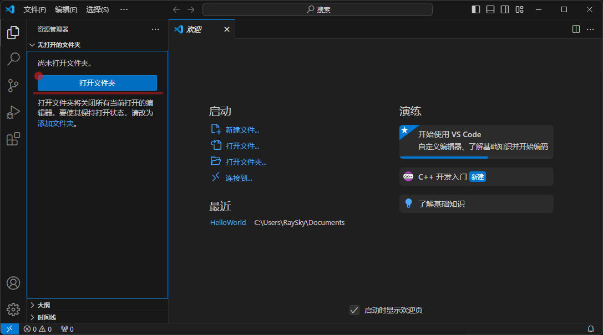

现在，新建一个名为 **_“helloworld.cpp”_** 的文件，开始为这份 C++ 源代码注入灵魂：

```cpp lineNumbers title="helloworld.cpp"
#include<iostream>
using namespace std;
int main(){
    cout<<"Hello World!";
    return 0;
}
```

Ctrl+S 保存一下这份新鲜出炉的 HelloWorld，接下来点击右上角出现的 **_“调试C/C++文件”_** 图标

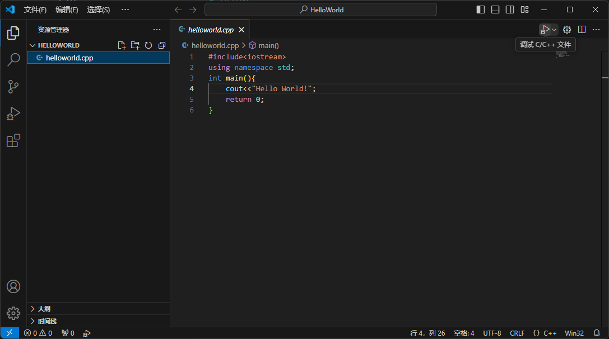

点击 **_C/C++: g++.exe 生成和调试活动文件_**

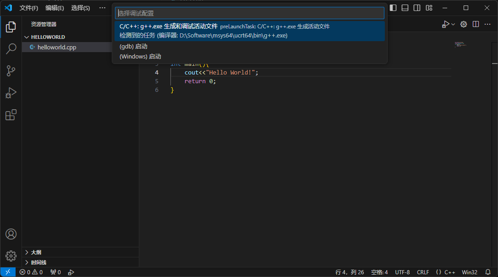

等待编译完成...然后... 庆贺罢！

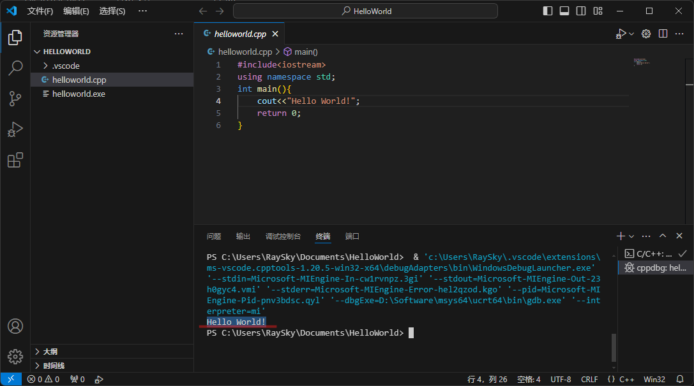

## 尾声

至此，这篇基础教程也告一段落了，经过以上这些配置后，你应该可以在 VSCode 中愉快地编写 C/C++ 代码了。

如果想要了解更多关于使用 VSCode 的进阶教程或是还有其他问题，可以前往百度，必应或谷歌搜索，或者查看微软官方详尽的教程文档（英文原版）[Documentation for Visual Studio Code](https://code.visualstudio.com/docs)

**_Good Luck & Have Fun :P_**
